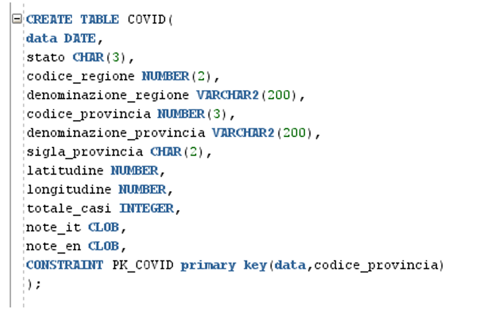
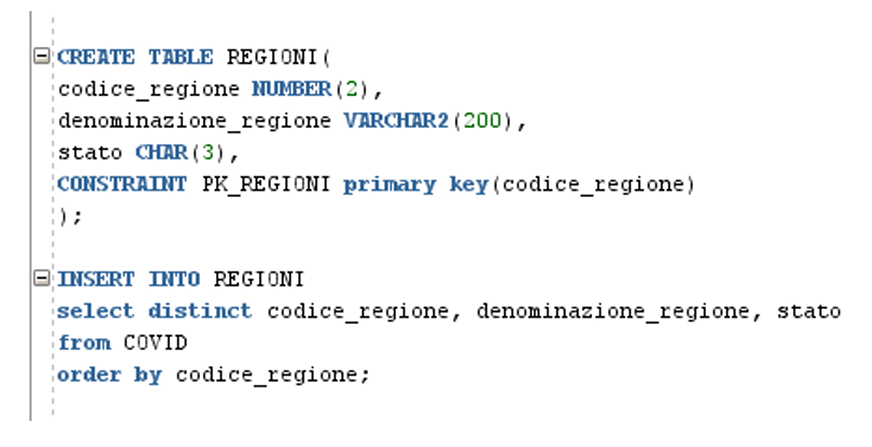
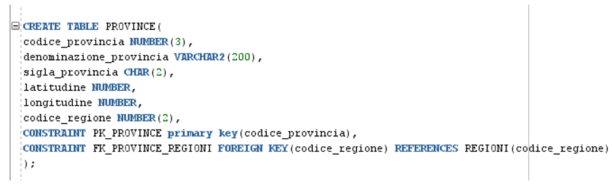
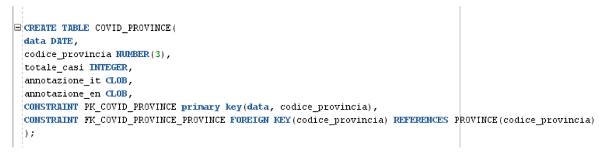
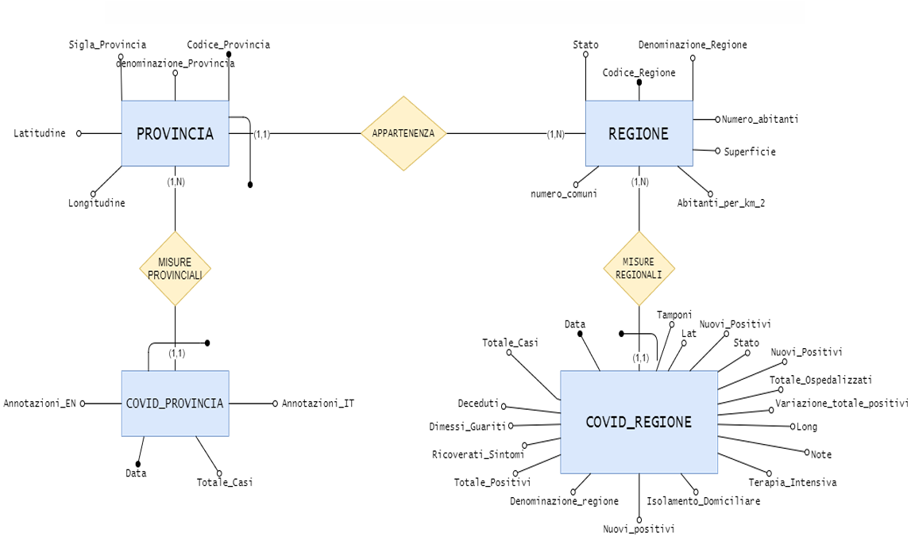
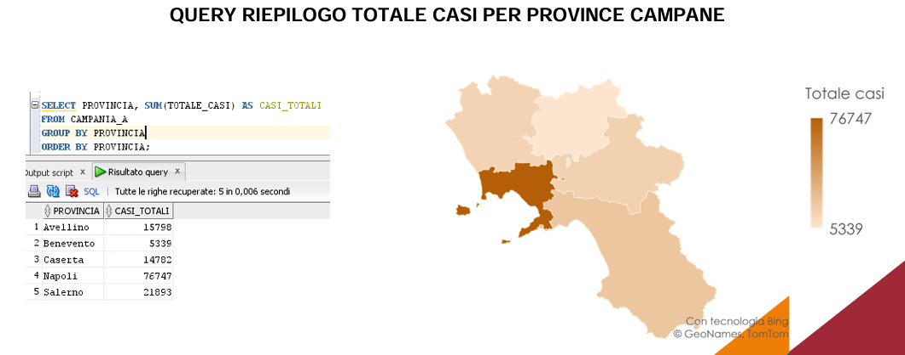
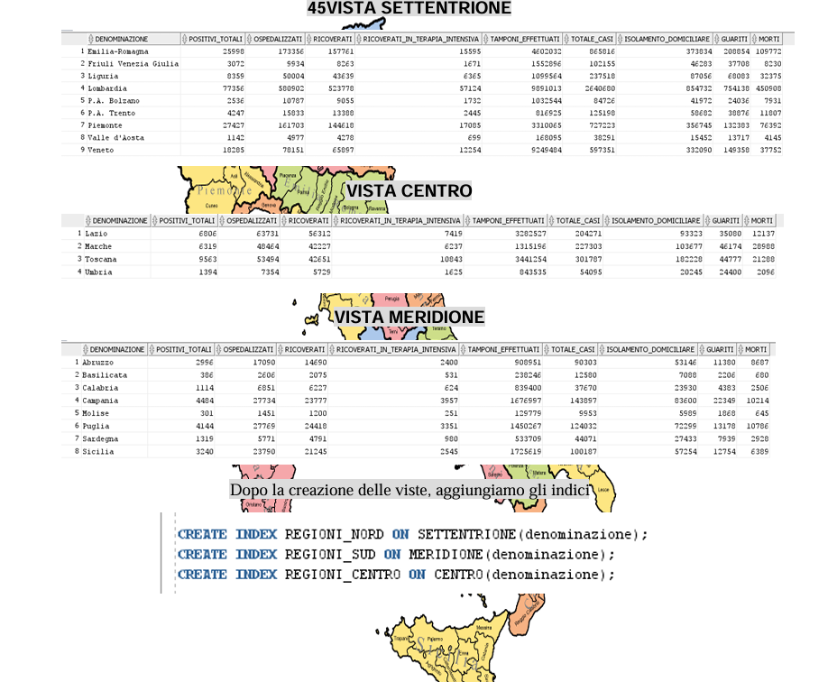
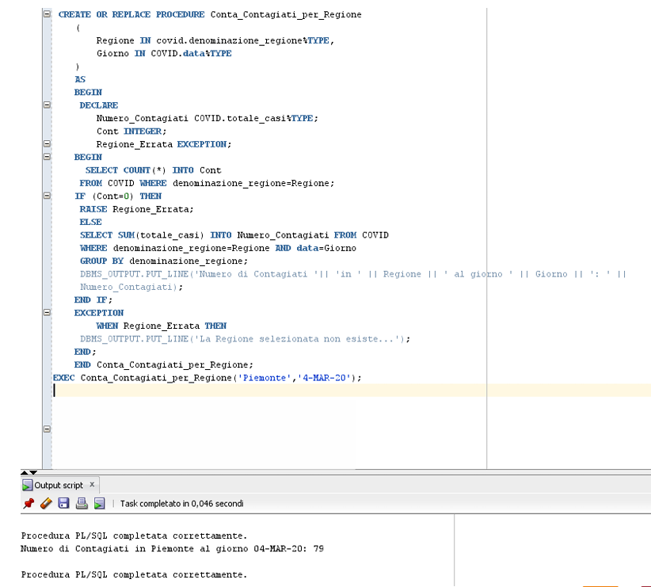
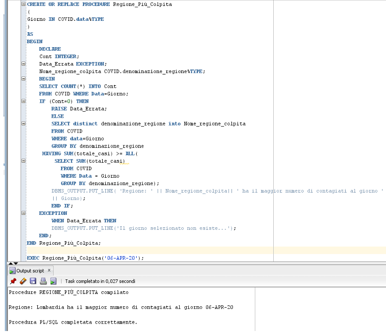
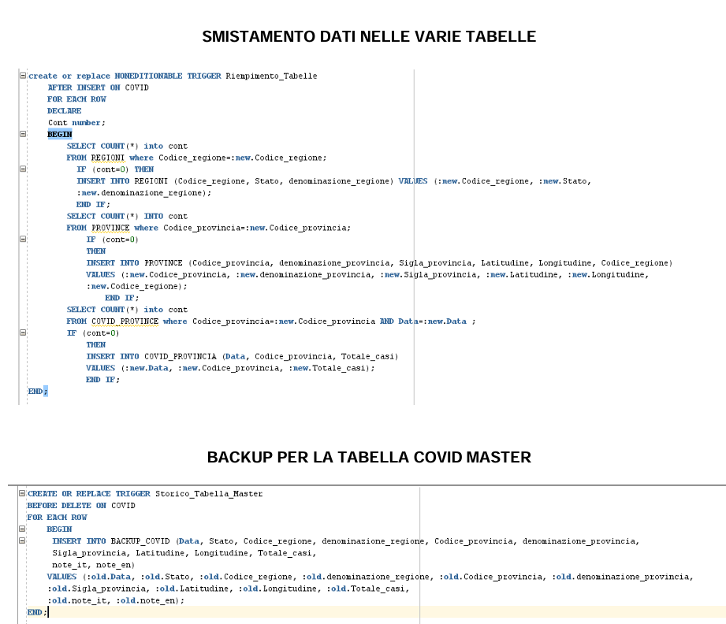

# COVID-19 Database Analytics

A relational database project developed using SQL and PL/SQL for the analysis of COVID-19 spread across Italian regions and provinces.

## Project Overview

The project was developed starting from the official COVID-19 dataset released by the Italian Civil Protection Department.

The original master table was analyzed and normalized up to Third Normal Form (3NF) to reduce redundancy and improve data consistency.

The final database includes regional and provincial information together with analytical tools such as SQL queries, views, indexes, stored procedures and triggers.

## Main Features

- Relational database design
- Database normalization (1NF, 2NF, 3NF)
- Entity-Relationship modeling
- SQL analytical queries
- Views and indexes for performance optimization
- PL/SQL stored procedures
- Database triggers
- COVID-19 data analysis and visualization

## Database Structure

### Master Table

### Normalized Schema

### Entity-Relationship Diagram

## Analytics Queries

### Region with the highest population density

### Average number of new positive cases by region

### Percentage of infected population by region

### Monthly trend of positive cases

### Positivity index by region

### COVID-19 cases in Campania provinces

## Views and Indexes

Views were created to group Italian regions into:

- Northern Italy
- Central Italy
- Southern Italy

Additional indexes were introduced to improve query performance.

## Stored Procedures

### Number of cases by region and date

### Most affected region on a selected date

## Triggers

The project includes triggers for:

- automatic population of normalized tables;
- backup of deleted records from the master table.

## Documentation

The complete academic report is available in:

`docs/report.pdf`

## Technologies

- Oracle Database
- SQL
- PL/SQL
- Database Design
- Entity-Relationship Modeling
- Microsoft Excel
- Google Sheets

## Author

Sara Auditano

B.Sc. Telecommunications Engineering

University of Naples Parthenope
