# IoT Security for Smart Pet Collar

## Project description

This project simulates the operation of an IoT pet collar that periodically sends data to a gateway/server.
The simulated data includes geographic position, body temperature, and timestamp.

The goal is to analyze the main security threats typical of IoT systems and design a more secure communication.

## System architecture

The project architecture consists of:

* an IoT device simulated through a Python script (**src/collar.py**)
* a gateway/server simulated through a Python backend (**src/server.py**, Flask)
* a network communication between device and server (plain HTTP in Phase 1)

## Repository structure

* `src/` contains the source code (collar and server)
* `docs/img/` contains evidence screenshots
* `logs/` contains server logs (generated during execution)

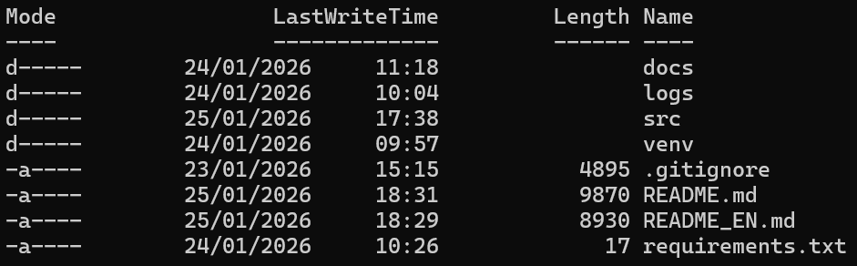

## Threat model

The project considers some common threats typical of IoT systems:

* data interception during transmission (sniffing)
* IoT device spoofing
* replay attack (reusing valid messages)
* unauthorized access to the server

## Security approach

The project is developed in two phases:

1. **Initial insecure version (Phase 1)**: used to highlight vulnerabilities and security issues.
2. **Improved version (Phase 2)**: introduction of basic countermeasures to mitigate the identified threats.

## Tools used

* Python
* GitHub for code sharing
* SAST tools (e.g., Bandit, SonarLint)
* DAST tools (OWASP ZAP)

## Security policy
This repository is for educational purposes only.

**Phase 1 contains intentional vulnerabilities** to demonstrate common IoT attacks.
**Do not deploy this code in production.**
> Note: All demonstrations were performed in a controlled local environment (localhost).

## Authors
- Sara Auditano (@b3omgyu)
- Federica Capuano (@federicacapuano02-maker)

---

## Running the project (Phase 1 – insecure)

### Prerequisites

* Python 3.x installed

### 1) Create and activate the virtual environment (Windows PowerShell)

Open PowerShell in the project folder and run:

```powershell
python -m venv venv
.\venv\Scripts\Activate.ps1
python -m pip install -r .\requirements.txt
```

### 2) Start the server (Flask)

In a terminal:

```powershell
python .\src\server.py
```

The server will be listening on `http://127.0.0.1:5000`.

### 3) Start the IoT collar (simulator)

In a second terminal (same folder, with the virtual environment active):

```powershell
.\venv\Scripts\Activate.ps1
python .\src\collar.py
```

### 4) Stop the processes

To stop the server or collar: **CTRL + C** in the corresponding terminal.

---

## Data format (JSON)

Example payload sent by the collar to the gateway:

```json
{
  "device_id": "collar-001",
  "timestamp": "2026-01-24T10:00:00Z",
  "temperature_c": 37.2,
  "position": { "lat": 40.8518, "lon": 14.2681 }
}
```

*(Values are simulated and change at each transmission.)*

---

## Evidence (Screenshots) – Phase 1 (insecure)

### 1) Communication test (working system)

The collar periodically sends JSON data and the gateway receives it correctly (HTTP 200).

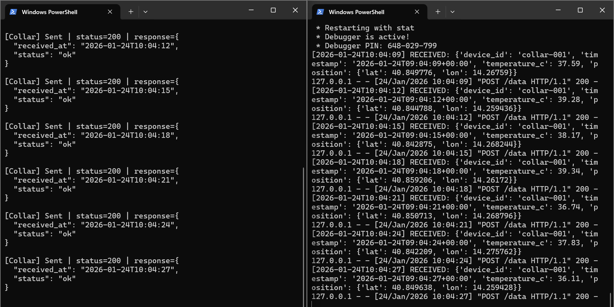

### 2) Attack: Spoofing (no authentication)

An unauthorized “device” can send data to the gateway and is accepted (HTTP 200).
The attack is performed by manually sending an HTTP POST request to the `/data` endpoint.

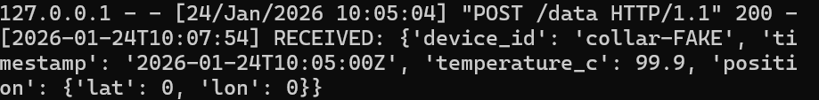

*Attacker-side output: manual request with `ok` response.*

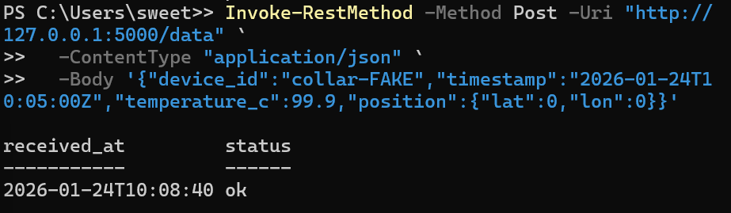

### 3) Attack: Lack of input validation

The gateway accepts payloads with invalid fields/types (e.g., temperature as a string, non-numeric coordinates) and still returns `status: ok`.

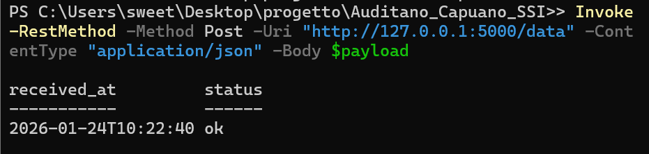

### 4) Attack: Sniffing (plain-text traffic)

Since communication happens over HTTP (without TLS), an attacker in the middle (e.g., a proxy) can read the payload content, including sensitive data such as location and temperature.

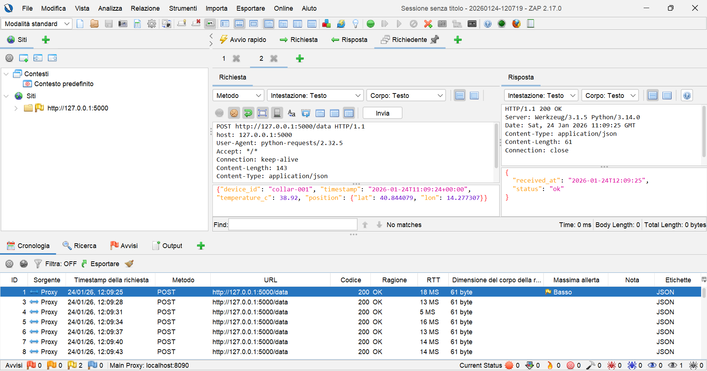

### 5) Replay attack (reuse of valid messages)

The same payload is resent and is accepted (HTTP 200) because there are no checks on nonce/timestamp or message signature.

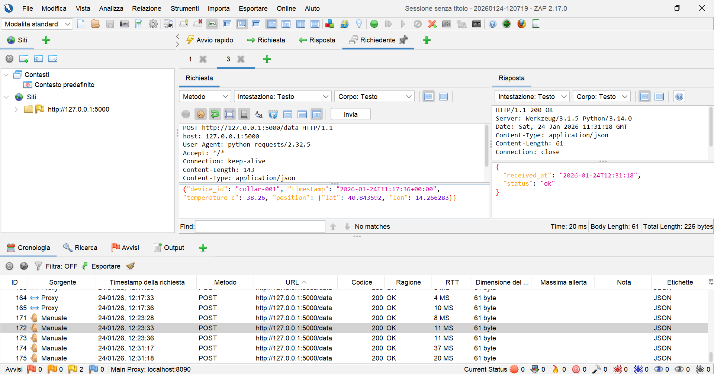

---

## Evidence (Screenshots) – Phase 2 (secure version)

In this phase, security countermeasures are introduced to mitigate
the vulnerabilities highlighted in Phase 1.

### 1) Mitigation: IoT device spoofing

**Problem (Phase 1):**
An unauthorized IoT device can send data to the gateway and is accepted
because there is no authentication mechanism.

**Implemented countermeasures (Phase 2):**

* authentication via API key (`X-API-KEY`)
* whitelist of authorized devices (`device_id`)
* rejection of invalid requests with HTTP 401 response

**Test performed:**
A malicious client attempts to send data using:

* an unauthorized `device_id`
* an incorrect or missing API key

**Result:**
The server correctly rejects the request, blocking the spoofing attempt.

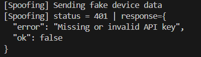

### 2) Mitigation: Lack of input validation

**Problem (Phase 1):**
The gateway accepts payloads with invalid or malformed fields
(e.g., non-numeric temperature, wrong coordinates),
still returning a success response (`status: ok`).

This behavior exposes the system to:

* inconsistent or corrupted data
* possible logical crashes server-side
* input manipulation attacks

**Implemented countermeasures (Phase 2):**

* full JSON payload validation
* check of required fields (`device_id`, `timestamp`, `temperature_c`, `position`)
* type checking (numbers/strings)
* immediate rejection of non-compliant payloads with HTTP 400 response

**Tests performed:**
Invalid payloads were sent on purpose using a dedicated script
(`collar_invalid.py`), simulating different input errors:

* invalid temperature (string instead of numeric value)
* invalid latitude
* invalid longitude

**Result:**
The server correctly detects each error and rejects the payload,
returning an explicit error message.

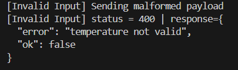
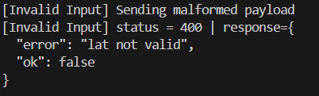
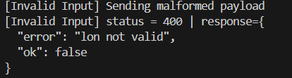

### 3) Mitigation: Sniffing (traffic interception)

**Problem (Phase 1):**
In the insecure version, communication between collar and server is plain (HTTP).
An attacker performing a Man-in-the-Middle (e.g., via OWASP ZAP proxy)
can intercept and read sensitive transmitted data, such as:

* `device_id`
* geographic position
* temperature
* timestamp

**Implemented countermeasures (Phase 2):**

* authentication via API key (`X-API-KEY`)
* authorized device checks
* rejection of unauthorized requests with HTTP 401 response

Even if the traffic is intercepted via proxy, the data cannot
be reused or accepted by the server without valid credentials.

**Test performed:**

* the collar is configured to pass through OWASP ZAP (proxy `127.0.0.1:8090`)
* HTTP traffic is correctly intercepted
* the server responds with `401 UNAUTHORIZED` when the API key is missing/invalid

**Result:**
Traffic can still be intercepted, but unauthorized requests are correctly
blocked by the server, reducing the impact of sniffing.

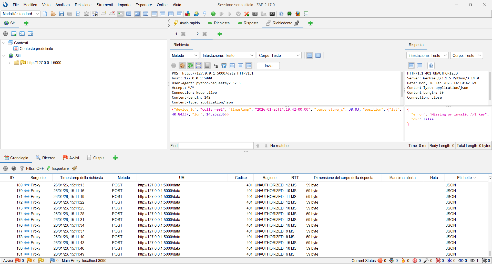
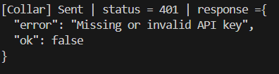

### 4) Mitigation: Replay attack (reuse of valid messages)

**Problem (Phase 1):**
The same payload can be resent multiple times and is accepted by the server
because there are no checks on timestamp or message uniqueness.

**Implemented countermeasures (Phase 2):**

* the payload includes a `timestamp` field
* the server accepts timestamps only within a time window (`MAX_SKEW_SECONDS`)
* reused messages are rejected

**Test performed:**

* first payload send → accepted (HTTP 200)
* second identical send (replay) → rejected (HTTP 401)

**Result:**
The replay attack is correctly detected and blocked by the server.

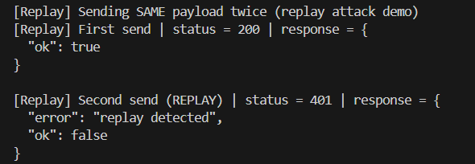

### Test with OWASP ZAP (Phase 2)

To verify replay mitigation also at network traffic level,
**OWASP ZAP** was used as an interception proxy.

**Procedure:**

* intercept a valid `POST /data` request
* manually resend the same payload via OWASP ZAP
* no changes to the message content (identical replay)

**Result:**

* the server responds with **HTTP 401 Unauthorized**
* the replay attack is correctly detected and blocked

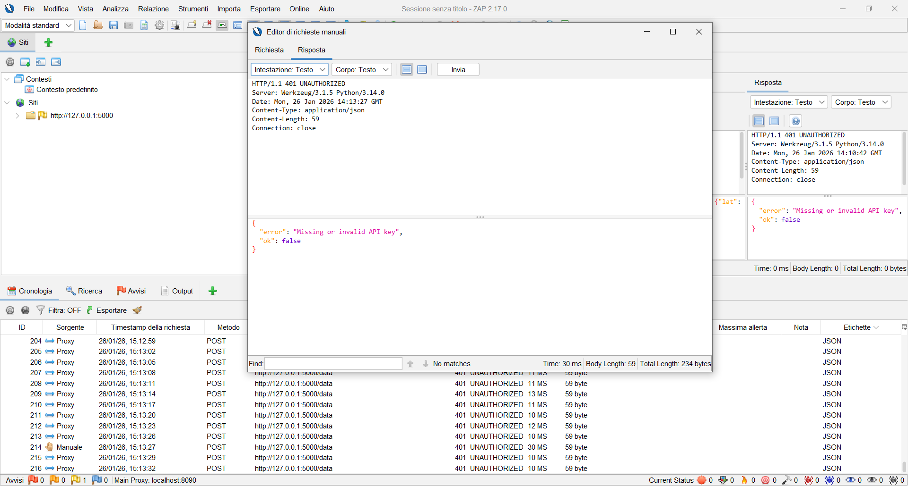

## Author

Sara Auditano

Federica Capuano

B.Sc. Telecommunications Engineering

University of Naples Parthenope
